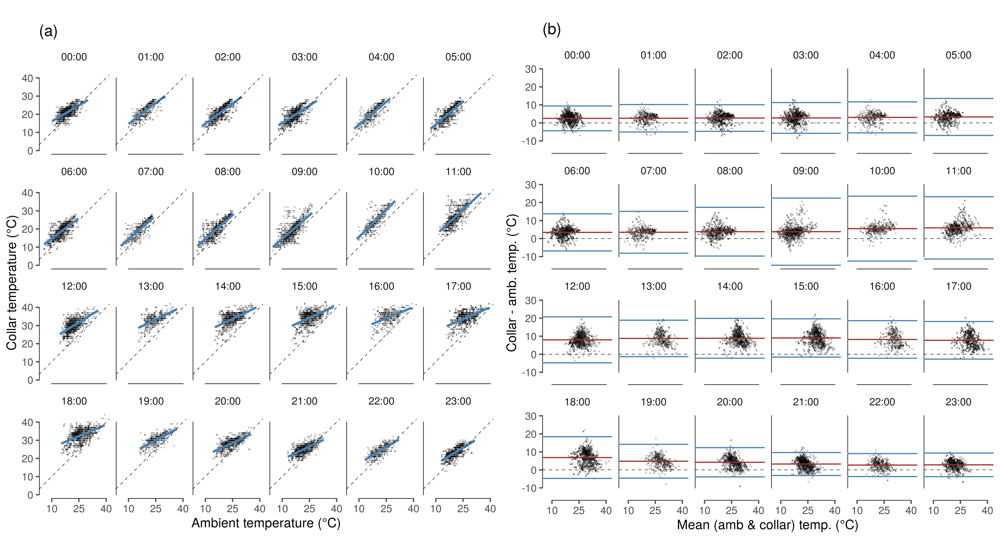

# Collar temperature and ambient temperature

Here we model the relationship between the temperature reported by inbuilt temperature sensors on the elephants' GPS collars, and the ambient temperature recorded at Skukuza.
For this comparison, we will only use data from positions recorded within 10 km of the weathe weather tower at Skukuza.

## Load libraries

```{r load_libs_03, message=FALSE, warning=FALSE, eval=FALSE}

# load libraries
library(dplyr)
library(purrr)
library(lubridate)
library(readr)
library(readxl)
library(glue)
library(stringr)
library(forcats)

# spatial
library(sf)

# plotting
library(ggplot2)
library(ggthemes)
library(viridis)

# custom funcs
ci = function(x) 1.96*sd(x, na.rm = T)/sqrt(length(x))
```

## Load tracking and temperature data

Read the tracking data from a number of elephants from 2006 -- 2011.

Read in the ambient temperature for approximately the same range, 2007 -- 2010.
Handle the date and time columns correctly using lubridate and floor the time to the nearest half hour.

```{r read_all_eles, eval=FALSE}
# read in data saved as csv from an excel file
data = read_csv("data/AllEles2011_UTM.csv")

# read in temperature data and select relevant cols
amb_temp = read_csv("data/skukuza_tower_temp.csv") %>% 
  `colnames<-`(c("date","time","prop_time","col4","temp.a","col6","col7")) %>% 
  select(date, prop_time, temp.a) %>% 
  mutate(date = fast_strptime(date, format = "%d/%m/%Y", lt = F),
         time = as.numeric(date) + prop_time*24*3600,
         time = as.POSIXct(time, origin = "1970-01-01"),
         time = floor_date(time, unit = "30 minutes")) %>% 
  select(time, temp.a)

# read in tower location
skukuza = read_csv("data/skukuza.csv") %>% 
  st_as_sf(coords = c("long","lat"), crs = 4326) %>% 
  st_transform(st_crs(32736))

# get buffer around skukuza
skz_buf = st_buffer(skukuza, dist = 10000)
```

## Select ele data near tower

### Convert to `sf` and filter

```{r make_spatial, eval=FALSE}
# make ele data spatial
data_sf = st_as_sf(data, coords = c("XUTM","YUTM"))
st_crs(data_sf) = 32736

# which eles are inside the buffer
data_keep = st_contains(skz_buf, data_sf)
data_keep = unlist(data_keep)

# eles to keep
data_tower = data[data_keep,]
```

### Clean filtered data

Here, process the date and time by converting the `Date_Time` column to POSIXct.
Then convert `time` to POSIXct by adding the proportional daily time to the numeric date. Finally, round the time to the nearest half hour. As a sanity check, _do the increments of Time_Number follow the increments in time?_

```{r clean_ele_data, eval=FALSE}
#'clean ele data
data.tow.clean = data_tower %>% 
  mutate(date = fast_strptime(Date_Time, format = "%d/%m/%Y", lt = F),
         time = as.POSIXct(as.numeric(date) + TimeNumber*24*60*60, 
                           origin = "1970-01-01"),
         time = floor_date(time, "30 min")) %>% 
  rename(temp = TempC)
```

## Combine collar and ambient temp

### Prepare data for Bland-Altman

Join the elephant data within 10 km of the tower with ambient temperature data from the tower by the time column. Exploring the data reveals that ambient temperature data records `NA` as `-9999`. 
Filter the data to exclude these values.

```{r match_ele_data, eval=FALSE}
#'match ele and flux tower
data.tow.clean.ba = data.tow.clean %>% 
  select(id = UnitID, time, temp, season = Season) %>% 
  left_join(amb_temp)

# filter combined data
data.tow.clean.ba = data.tow.clean.ba %>% 
  filter(temp.a >= -5, !is.na(temp), !is.na(temp.a)) %>% 
  mutate(hour = hour(time), 
         season = as_factor(season),
         temp = as.numeric(temp))
```

### Prepare Fig. 3 (A): Daily temperature trend

```{r fig_temp_hour, eval=FALSE}
# make figure of temps per hour of day
data_fig3a = data.tow.clean.ba %>% 
  group_by(hour, season) %>% 
  summarise_at(vars(temp, temp.a), list(mean = mean, ci = ci)) 

fig_temp_measure_hour = ggplot(data_fig3a, aes(x = hour))+
  
  geom_rangeframe(data = data_frame(x = c(0,23), y=c(15,40)), aes(x,y))+
  
  geom_path(aes(y = temp_mean, col = season), lty = 1)+
  
  geom_path(aes(y = temp.a_mean, col = season), lty=2)+
  
  geom_ribbon(aes(ymin = temp_mean - temp_ci, ymax = temp_mean + temp_ci, group = season, fill = season), alpha = 0.2)+
  
  geom_ribbon(aes(ymin = temp.a_mean - temp.a_ci, ymax = temp.a_mean + temp.a_ci, group = season, fill = season), alpha = 0.2)+
  
  scale_colour_brewer(palette = "Set1")+
  scale_fill_brewer(palette = "Set1")+
  scale_x_continuous(breaks = c(0,4,8,12,16,20,23))+
  scale_y_continuous(breaks = seq(15,40,5))+
  
  theme_few()+
  theme(legend.position = "none", panel.border = element_blank(),
        axis.text = element_text(size = 8),
        axis.title = element_text(size = 8))+
  coord_cartesian(xlim = c(0,23))+
  labs(x = "Hour of day", y = "Temperature (°C)", title = "(a)")
```

## Exploring collar and ambient temp

### Prepare data for models

```{r prep_collar_ambient, eval=FALSE}
# load statistical package lme4
library(lme4)

mean_wo_na = function(x) mean(x, na.rm=T)
sd_wo_na = function(x) sd(x, na.rm = T)

# random effects model for within individual and hour std deviation
# get the mean data
ele.BA.data = ungroup(data.tow.clean.ba) %>% 
  mutate(diff = temp-temp.a, mean.temp = (temp+temp.a)/2) %>% 
  mutate(hour.plot = paste(str_pad(hour, 2, side = "left", pad = "0"), ":00", sep = ""))
```

### Run models per hour

```{r run_collar_ambient, eval=FALSE}
# run mods in each hour
ele.BA.mods = ungroup(ele.BA.data) %>%
  split(ele.BA.data$hour.plot) %>% 
  map(function(x){
    lmer(temp ~ temp.a + season + (1|id), data = x)
  })

# prepare predict data
ele.pred.data = ele.BA.data %>% 
  split(ele.BA.data$hour.plot)

# predict from the model on prepared data
ele.tempmod.fit = map2(ele.pred.data, ele.BA.mods, function(x,y){
  x %>% 
    mutate(pred = predict(y, newdata = x, type = "response", se.fit = T))
}) %>% bind_rows()
```

### Prepare data for plotting

Extract the variance-correlation components from the hour-wise models using `lme4::VarCorr`.
Get the standard deviation for each hour.

```{r prepare_figure_data, eval=FALSE}
# summarise model data using multiple maps
ele.ba.summary = ele.BA.mods %>% 
  map(.f = VarCorr) %>% 
  map(function(x){
    data_frame(sd_id = as.data.frame(x) %>% 
                 .$sdcor %>% 
                 sum())
}) %>% bind_rows() %>% 
  mutate(hour = 0:23) %>% 
  mutate(hour.plot = paste(str_pad(hour, 2, side = "left", pad = "0"), ":00", sep = ""))

# get the mean differences from the data prepared for the model
# join to the hour-wise standard deviation
mean_diff = ele.BA.data %>% 
  group_by(hour.plot) %>% 
  summarise(diff = mean(diff, na.rm = T)) %>% 
  left_join(ele.ba.summary)
```

### Prepare Bland-Altman plots

Plot the hour-wise relationship between collar temperature and ambient temperature, and the hour-wise Bland-Altman plots.

```{r make_ba_figure, eval=FALSE}
#'make appendix figure a
fig_temp_rel_hr = 
  ggplot()+
  geom_rangeframe(data = data_frame(x=c(10,40), y = c(0,40)), aes(x,y))+
  geom_point(data = ele.BA.data, aes(x = temp.a, y = temp), size = 0.1, alpha = 0.2)+
  geom_smooth(data = ele.tempmod.fit, aes(x = temp.a, y = pred), method = "glm", 
              col = "steelblue")+
  geom_abline(slope = 1, lty = 2, col = 1, lwd = 0.2)+
  scale_x_continuous(breaks = c(10,25,40))+
  facet_wrap(~hour.plot, nrow = 4)+
  theme_few()+
  coord_fixed()+
  theme(panel.border = element_blank())+
  labs(x = "Ambient temperature (°C)", y = "Collar temperature (°C)", title = "(a)")

#'appendix figure b
fig_ba_hour = 
  ggplot()+
  geom_rangeframe(data = data_frame(x=c(10,40), y = c(-10,30)), aes(x,y))+
  geom_point(data = ele.BA.data, aes(x = mean.temp, y = diff), 
             size = 0.1, alpha = 0.2)+
  geom_abline(slope = 0, lty = 2, col = 1, lwd = 0.2)+
  geom_hline(data = mean_diff, aes(yintercept = diff), col = "brown")+
  geom_hline(data = mean_diff, aes(yintercept = 1.96*sd_id + diff), col = "steelblue")+
  geom_hline(data = mean_diff, aes(yintercept = diff - 1.96*sd_id), col = "steelblue")+
  #coord_cartesian(ylim = c(0,40), xlim = c(0,40))+
  scale_y_continuous(breaks = seq(-10,30, 10))+
  
  scale_x_continuous(breaks = c(10,25,40))+
  theme_few()+
  theme(panel.background = element_blank())+
  facet_wrap(~hour.plot, nrow = 4)+
  coord_fixed()+
  theme(panel.border = element_blank())+
  labs(x = "Mean (amb & collar) temp. (°C)", y = "Collar - amb. temp. (°C)", title = "(b)")

fig_hourwise_collar_ambient = gridExtra::grid.arrange(fig_temp_rel_hr, fig_ba_hour, nrow = 1)

ggsave(fig_hourwise_collar_ambient, 
       filename = "figs/fig_hourwise_collar_ambient.png", 
       device = png(), height = 180/25.4, width = 1.5*180*1.2/25.4, dpi = 300)
```

```{r show_fig_temp_relations, eval=TRUE, echo=FALSE}

```


## Model collar and ambient temp

### LMM collar and ambient temp

Run a global linear mixed effects model for collar temperature as a function of ambient temperature. Write the model summary to a text file.

```{r model_global_collar_amb, eval=FALSE}
# run global lmm for collar and ambient temperature
mod.temp = lmer(temp ~ temp.a + season + (1|hour) + (1|id), data = data.tow.clean.ba)

# write model summary
if(!dir.exists("data/model_output")){
  dir.create("data/model_output")
}

# clear old output
if(file.exists("data/model_output/model_collar_amb_temp.txt")){
  file.remove("data/model_output/model_collar_amb_temp.txt")
}

R.utils::captureOutput(summary(mod.temp), 
              file = "data/model_output/model_collar_amb_temp.txt",
              append = TRUE)

R.utils::captureOutput(car::Anova(mod.temp),
                       file = "data/model_output/model_collar_amb_temp.txt",
              append = TRUE)
```

Print the model summary.

```{r show_glob_temp_mod, eval=TRUE, comment=''}
cat(readLines("data/model_output/model_collar_amb_temp.txt"), sep = "\n")
```

### Get variance components

```{r collar_amb_mod_variance, eval=FALSE}
# calculate variance components and print
# variance of random effects
var_eff_hour = as.numeric(VarCorr(mod.temp))[1]
var_eff_Id = as.numeric(VarCorr(mod.temp))[2]

# residual
var_res = as.numeric(attr(VarCorr(mod.temp), "sc")^2)

# fixed effects only
var_fix = var(predict(lm(temp ~ temp.a + season, data = data.tow.clean.ba)))

# total data variance
var_tot = var(data.tow.clean.ba$temp)

# proportional variances
p_var = c(var_eff_hour, var_eff_Id, var_res, var_fix)*100/var_tot

# make data frame and save
mod_collar_amb_temp_variance = 
  data_frame(component = c("hour", "id", "residual", "fixed_effects"),
             variance = c(var_eff_hour, var_eff_Id, var_res, var_fix),
             percentage = p_var)

# write to file
write_csv(mod_collar_amb_temp_variance, 
          path = "data/model_output/mod_collar_amb_temp_variance.txt")
```

Print the variance components of the model.

```{r show_variance_comp_mod_temp, eval=TRUE, echo=TRUE, message=FALSE}
variance_comp_temp_amb = read_csv("data/model_output/mod_collar_amb_temp_variance.txt")
knitr::kable(variance_comp_temp_amb)
```

### Prepare Figure 3 (B): Collar ~ ambient temperature

Prepare a figure of the relationship between collar temperature and ambient temperature. This forms *figure 3B* of the manuscript.

```{r figure_global_collar_amb, eval=FALSE}
# plot figure of mean relationship collar and ambient temp
fig_temp_rel_data <- data.tow.clean.ba %>% 
  group_by(season, temp.a = round(temp.a)) %>%
  summarise_at(vars(temp), list(temp_mean = mean, temp_ci = ci))
  
fig_temp_measure_relation <- 
ggplot()+
  geom_smooth(data = fig_temp_rel_data, 
              aes(x = temp.a, y = temp_mean, group = season, 
                  col = season, fill = season), method = "glm", 
              se =T, alpha = 0.2,lwd = 0.5)+
  
  geom_pointrange(data = fig_temp_rel_data, 
                  aes(x = temp.a, y =  temp_mean, 
                      ymin = temp_mean-temp_ci , ymax = temp_mean+temp_ci, 
                      shape = season, col = season), 
                  position = position_dodge(width = 0.5), 
                  fill = "white", size = 0.1, stroke = 0.4)+
  geom_rangeframe(data = data_frame(x = c(5,40), y = c(4,44)), aes(x,y))+
  
  geom_abline(slope = 1, lty = 2)+

  scale_colour_brewer(palette = "Set1")+
  scale_fill_brewer(palette = "Set1")+
  scale_shape_manual(values = c(21, 24))+
  scale_x_continuous(breaks = seq(5,40,5))+
  scale_y_continuous(breaks = seq(4,44,8))+
  
  coord_cartesian(xlim=c(5,40), ylim = c(5,44))+
  theme_few()+
  theme(panel.border = element_blank(), legend.position = "none",
        axis.text = element_text(size = 8),
        axis.title = element_text(size = 8))+
  labs(x = "Ambient temperature (°C)", y = "Collar temperature (°C)", title = "(b)")
```

## Global Bland-Altman test

Prepare a global Bland Altman test and associated plots.

### Prepare data for global Bland-Altman

```{r global_bland_altman, eval=FALSE}
# get data for global BA plot
ele.BA.data = ele.BA.data %>% 
  filter(!is.na(temp), !is.na(temp.a)) %>% 
  ungroup() %>% 
  group_by(id, hour, season) %>% 
  summarise_at(vars(temp, temp.a), funs(mean)) %>% 
  mutate(mean.measures = (temp+temp.a)/2,
         diff.measures = temp-temp.a) %>% 
  ungroup() %>% 
  group_by(mean.measures = round(mean.measures), season) %>% 
  summarise_at(vars(diff.measures), funs(mean))
```

### GAMM for Bland-Altman trend

```{r global_ba_gamm, eval=FALSE}
# run a gamm of differences vs mean for the BA data
library(mgcv)

BA.gam = gam(diff.measures ~ s(mean.measures, by = season), data = ele.BA.data)

# write summary to file and then read and show
# clear old output
if(file.exists("data/model_output/model_gamm_BA.txt")){
  file.remove("data/model_output/model_gamm_BA.txt")
}

R.utils::captureOutput(summary(BA.gam), 
              file = "data/model_output/model_gamm_BA.txt",
              append = TRUE)

# get model predictions
ele.BA.data$pred = predict(BA.gam, type = "response", 
                           newdata = ele.BA.data, se.fit = T)[[1]]
ele.BA.data$se = predict(BA.gam, type = "response", 
                         newdata = ele.BA.data, se.fit = T)[[2]]
```

Print the GAMM summary.

```{r show_model_BA, eval=TRUE, comment=''}
cat(readLines("data/model_output/model_gamm_BA.txt"), sep = "\n")
```

### Prepare Fig. 3 (C): Bland-Altman plot

```{r predictions_ba_gamm, eval=FALSE}
# prepare global bland altman figure
figBArevised = ggplot(ele.BA.data)+
  
  geom_ribbon(aes(x = mean.measures, ymin = pred-se, ymax = pred+se, fill = season), 
              alpha = 0.2)+
  geom_line(aes(x = mean.measures, y = pred, col = season), lty = 2)+
  
  geom_point(aes(x = mean.measures, y = diff.measures, col = season, shape = season), 
             fill = "white", size = 1,stroke = 0.5)+
  scale_color_brewer(palette = "Set1", direction = -1)+
  scale_fill_brewer(palette = "Set1")+
  scale_shape_manual(values = c(24,21))+
  geom_rangeframe(data = data_frame(x=c(15,35), y = c(-5,20)), aes(x,y))+
  
  geom_hline(yintercept = c(0,mean(mean_diff$diff),  
                            mean(mean_diff$diff) + 1.96*mean(mean_diff$sd_id),
                            mean(mean_diff$diff) - 1.96*mean(mean_diff$sd_id)), 
             lty = c(2,1,1,1), 
             lwd = c(0.2, 0.4,0.4,0.4), 
             col = c("black","brown","steelblue","steelblue"))+
  theme_few()+
  theme(legend.position = "none", 
        panel.border = element_blank(),
        axis.text = element_text(size = 8),
        axis.title = element_text(size = 8))+
  scale_y_continuous(breaks = c(seq(-5,20, 5)))+
  
  labs(x = "Mean (collar & amb.) temp (°C)", 
       y = "Collar temp. - amb. temp. (°C)", title = "(c)")
```

### Write hourly model summaries to file

Gather model output for temperature models per hour and write to file.

```{r hourly_model_output, eval=FALSE}
# hourly model output
# this is complicated code, please don't do it this way
ele.temp.mods.summary = ele.BA.mods %>% 
  map(summary) %>% 
  map(function(x){
    x$coefficients %>% 
      as.data.frame() %>% 
      select(Estimate, `t value`) %>% 
      mutate(predictor = rownames(.)) %>% 
      tidyr::gather(lmm_output, value, -predictor) %>% 
      filter(predictor != ("(Intercept)")) %>% 
      mutate(value = plyr::round_any(value, 0.01)) %>% 
      tidyr::spread(lmm_output, value)}) %>% 
  bind_rows() %>% 
  mutate(hour = rep(0:23, each = 2), predictor = ifelse(predictor != "temp.a", "season", predictor)) %>% 
  
  left_join(map(ele.BA.mods, function(x){
    car::Anova(x) %>% 
      as.data.frame() %>% 
      mutate(predictor = rownames(.)) %>% 
      rename(p_value = `Pr(>Chisq)`) %>% 
      select(-Df)}) %>% 
      bind_rows() %>% 
      mutate(hour = rep(0:23, each = 2), 
             Chisq = plyr::round_any(Chisq, 0.1), 
             p_value = plyr::round_any(p_value, 0.001)))
```

```{r export_temp_mod_summary, eval=FALSE}
# export to csv
write_csv(ele.temp.mods.summary, path = "data/model_output//ele_temp_mods_summary.txt")
```

## Figure 3: Collar and ambient temperature

```{r prep_figure_collar_amb_temp, eval=FALSE}
half = 85/25.4; full = 180/25.4

# export fig for temp measures
library(gridExtra)

figure_03_temperature_sources = grid.arrange(fig_temp_measure_hour, fig_temp_measure_relation, figBArevised, nrow = 1)

ggsave(figure_03_temperature_sources,
       filename = "figs/figure_03_temperature_sources.pdf",
       height = half, width = full)
```

```{r show_figure_03, eval=TRUE, echo=TRUE, message=FALSE, fig.cap="**(a)** Mean collar temperature (solid lines) and measured ambient temperature from Skukuza flux tower (dashed lines) at each hour of day in each season (dry: red lines, wet: blue lines) over the study period. Ninety-Five percent confidence intervals (CI) about each line are shaded. **(b)** Correlation between mean collar temperature from elephants within 10 km of the Skukuza flux tower (from n = 3 elephants) and time-matched ambient temperatures measured by the flux tower in each season (dry: red circles, wet: blue triangles). The dashed line denotes the line of identity where collar temperature equals ambient temperature. Bars represent 95% CI at each point. **(c)** Bland-Altman limits of agreement plot comparing collar temperatures and ambient temperatures from the Skukuza flux tower, accounting for repeated measures of individual elephants and hour of day (n = 28,853 total comparisons). The bias between the two measures at each mean temperature is marked by symbols colored by season (dry: red circles, wet: blue triangles). The black dashed line marks zero difference between the two measures. The upper and lower limits of agreement are shown as the standard normal deviate (1.96) times the standard deviation due to elephant identity, and are marked by solid blue lines, while the mean difference in measures is marked by the solid red line."}
library(magick)
fig03 = magick::image_read_pdf("figs/figure_03_temperature_sources.pdf")
fig03
```
