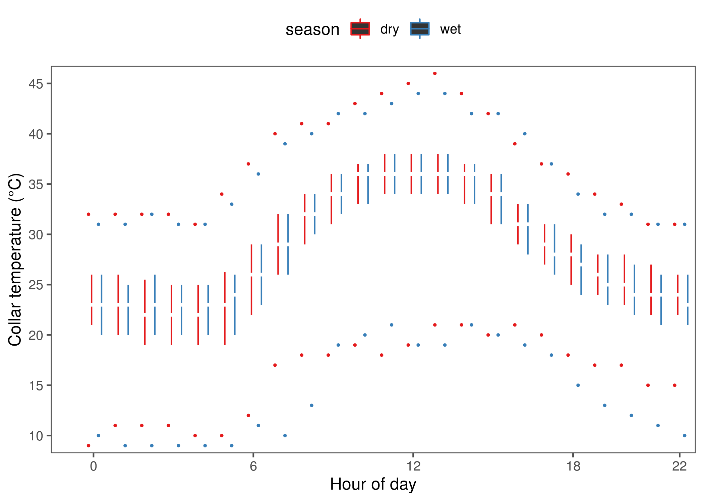

---
editor_options:
  chunk_output_type: console
---

# Elephant movement between water

Here, we look at elephants movement between water sources, and the speed, collar temperature, and distance to water along these segments.

## Load libraries

```{r load_libs_05, message=FALSE, warning=FALSE, eval=FALSE}

# load libraries
library(dplyr)
library(purrr)
library(lubridate)
library(readr)
library(readxl)
library(glue)
library(stringr)

# spatial
library(sf)

# plotting
library(ggplot2)
library(ggthemes)

# custom funcs
ci = function(x) 1.96*sd(x, na.rm = T)/sqrt(length(x))

# frontiers figure sizes in inches
full = 180/25.4; half = 85/25.4
```

## Load elephant data

Here we load elephant data and add a column identifying points which are within 200m of a water source. 200m is approximately the mean movement distance between two elephant positions.

```{r load_elephant_data_s05, eval=FALSE}
# load elephant data and find points within 200m of water
data = read_csv("data/elephant_data.csv")

data = data %>%
 select(id, season, xutm, yutm,
   time, v, hour, mindw, temp,
   long, lat, angle) %>%
  mutate(timenum = as.numeric(time)) %>%
  group_by(id) %>%
  mutate(waterdiff = c(NA, diff(mindw)),
         watervisits = as.numeric(mindw <= 200))

```

What proportion of elphant locations are near water?

```{r ele_at_water, eval=FALSE}
# get proportions
data_at_water = count(data, id, water = mindw <= 200) %>%
  group_by(id) %>%
  mutate(prop_water = n/sum(n)) %>%
  filter(water == TRUE)

# write proportions
write_csv(data_at_water, "data/data_prop_at_water.csv")
```

```{r show_at_water_prop, eval=TRUE, message=FALSE}
knitr::kable(read_csv("data/data_prop_at_water.csv") %>%
               select(id, prop_water) %>%
               mutate(prop_water = scales::percent(round(prop_water, 4))))
```


## Get time between water visits

How much time has passed between consecutive visits to water?

```{r time_bw_watervisits, eval=FALSE}
# select watervisits and find the time since the previous one
# remove points with NAs
data_water = data %>%
  filter(watervisits == 1) %>%
  group_by(id) %>%
  arrange(time) %>%

  mutate(wvint = c(NA, diff(timenum))/3600) %>%
  na.omit()
```

## Classify arrival and departure from water

Here we identify where the elphant arrives at water (or within 200m, rather), leaves from water, and is _at_ water.

```{r classify_arrival_departure, eval=FALSE, message=FALSE}
# split by id, arrange by time, identify a change from water visit to non-watervisit points,
# where there's a positive change, ie, status shifts from non-watervisit to watervisit, classify as arrival,
# where a negative change, classify as departure,
# where no change but point is within 200m of water, classify as at water,
# all others where no change classify as segment points
data <- data %>%
  left_join(data_water) %>%
  split(data$id) %>%

  map(function(df){
    df %>%
      arrange(timenum) %>%
      mutate(ss = c(NA, diff(watervisits))) %>%
      filter(!is.na(ss)) %>%
      mutate(behav = case_when(ss == 1 ~ "arrival",
                               ss == -1 ~ "departure",
                               ss == 0 & watervisits == 1 ~ "at water",
                               ss == 0 ~ "segment", T~ as.character(NA)))
  })

# bind rows
data <- bind_rows(data)
```

### Temperature at arrival

```{r arrival_temperature, eval=FALSE}
# asked for in review, I believe
# load lme4
library(lme4)

# run model of temperature at arrival against the hour of arrival and season
model_arrival_temp = lmer(temp ~ hour + season + (1|id),
                      data = filter(data, behav == "arrival"))

# run model summary
if(!dir.exists("data/model_output")){
  dir.create("data/model_output")
}

# write model summary
R.utils::captureOutput(summary(model_arrival_temp),
              file = "data/model_output/model_arrival_temp.txt",
              append = TRUE)
```

Print the model summary.

```{r show_model_speed, eval=TRUE, comment=''}
cat(readLines("data/model_output/model_arrival_temp.txt"), sep = "\n")
```

How long does each elephant usually remain near water?

```{r duration_near_water, eval=FALSE}
# subset points where elephants are at water or arriving
data_water_duration <- data %>%
  split("id") %>%
  map(function(df){
    df %>%
      arrange(timenum) %>%
      filter(behav %in% c("at water","arrival")) %>%
      mutate(watertime = cumsum(behav == "arrival")) %>%
      filter(behav == "at water") %>%
      group_by(id, watertime) %>%
      summarise(duration_at_water = as.numeric(diff(range(time),
                                                        units = "hours")))
  }) %>%
  bind_rows() %>%
  ungroup() %>%
  group_by(id) %>%
  summarise_at(vars(duration_at_water), list(mean=mean, max=max, min=min, ci95=ci))

# write to file
write_csv(data_water_duration, path = "data/data_water_duration.csv")
```

```{r show_water_duration, eval=TRUE, message=FALSE}
knitr::kable(read_csv("data/data_water_duration.csv"))
```

## Identify segments between water

### Count depatures and assign segment id

```{r per_ele_watertime, eval=FALSE}
# arrange by time, remove at water points,
# assign segment id (loop) as cumulative sum of departures.
# segments now begin at departures and end at arrival
data <- data %>%
  split("id") %>%
  map(function(x){
    x %>%
      arrange(timenum) %>%
      filter(behav != "at water") %>%
      mutate(loop = cumsum(behav == "departure"))
  }) %>%
  bind_rows()
```

### Summarise segments between water

For each elephant and each segment, find
1. the segemnt duration in hours
2. the segment time in hours
3. the segment proportion in time.

```{r summarise_segments01, eval=FALSE}
# run calculations on each elephant as list element
data <- data %>%
  group_by(id, loop) %>%
  mutate(loopdur = (last(timenum) - first(timenum))/3600,
         looptime = (timenum - first(timenum))/3600,
         loopprop = looptime/loopdur)
}
```

### Segments used and unused

```{r segments_used_unused, eval=FALSE, message=FALSE}
# review question, what's different between used and unused segments
ele.used.segments = data %>%
    filter(loopdur < 120) %>%
    group_by(id, loop) %>%
    mutate(nfixes = length(xutm)) %>%
    filter(nfixes > 25) %>%
    select(-nfixes)

ele.unused.segments = data %>%
    filter(loopdur < 120) %>%
    anti_join(ele.used.segments)

# plot differences
ele.unused.segments = ele.unused.segments %>% mutate(type = "unused")
ele.used.segments = ele.used.segments %>% mutate(type = "used")

# prep data
ele.segment.data = bind_rows(ele.unused.segments, ele.used.segments)

# show the loop duration differences between used and unused segments
fig_used_segments = ggplot(ele.segment.data)+
  geom_boxplot(aes(x = type, y = loopdur, col=type))+
  theme_few()+
  theme(legend.position = "none")+
  ylim(0,120)+
  labs(x = NULL, y = "segment duration (hrs)")

# save figure
ggsave(fig_used_segments, filename = "figs/fig_used_segments.png")
```

```{r show_fig_used, eval=TRUE, echo=TRUE, fig.cap="Loop duration differences between segments used in this paper and those unused."}

```

### Collar temperature at water

```{r temp_at_water}
# get the temperature of eles at water, temp by hour
fig_temp_at_water_hour <-
ggplot()+
  geom_tufteboxplot(data = data_water,
                    aes(x = as.factor(hour), y = temp,
                        group = interaction(season, hour), col = season),
                    median.type = "line", whisker.type = "point")+

  scale_colour_brewer(palette = "Set1")+

  scale_x_discrete(breaks = c(0, 6, 12, 18, 22))+
  scale_y_continuous(breaks = seq(10, 45, 5))+
  theme_few()+
  theme(legend.position = "top")+
  coord_cartesian(xlim=c(0,23), y = c(10,45), expand = T)+
  geom_rangeframe(data=data_frame(x = c(1,23), y=c(10,45)), aes(x,y))+
  labs(x = "Hour of day", y = "Collar temperature (°C)")

# save figure
ggsave(filename = "figs/fig_temp_at_water.png",
       fig_temp_at_water_hour)
```

Show the boxplot of collar temperature at water.

```{r show_fig_temp_water, eval=FALSE}

```

### Distribution of loop durations

What is the distribution of durations of the used segments?

```{r loop_durations, eval=FALSE}
# what is the 90th percentile of loop durations
# around 120 hours
quantile(data$loopdur, na.rm = T, 0.90)

# diagnostic plot of loop durations
fig_segment_distr = ggplot(data)+
  stat_density(aes(x = loopdur, y = ..count.., col = season),geom = "line", position = "identity")+
  scale_color_brewer(palette = "Set1")+
  scale_y_continuous()+
  theme_few()+
  theme(legend.position = "top")+
  labs(x = "segment duration (hrs)", y = "segments")+
  xlim(0,120)

# save figure
ggsave(fig_segment_distr, filename = "figs/fig_segment_distr.png")
```

```{r show_loop_durations, eval=TRUE}
knitr::include_graphics("figs/fig_segment_distr.png")
```

## Distance along segments

```{r add_distance_segments, eval=FALSE}
# add distance along segments
data = data %>%
  ungroup() %>%
  group_by(id, loop) %>%
  arrange(time) %>%
  mutate(distance = c(NA,
         sqrt(((xutm[2:length(xutm)] - xutm[1:length(xutm)-1])^2) +
         ((yutm[2:length(yutm)] - yutm[1:length(yutm)-1])^2))))
```

## Segment metrics

Calculate a number of metrics for each segment: the first and last x-y coords, the season, the time taken for the loop to be completed, the mean speed, the temperature at the halfway point, the mean temperature along the loop, the instantaneous change in temp at the halfway stage.

### Calculate segment metrics

```{r segment_summary, eval=FALSE}
# now find the displacement between the first and last point
library(sf)

# get segment statistics
data_summary = data %>%
  filter(loopdur < 120) %>%
  group_by(id, loop) %>%
  arrange(time) %>%
  mutate(nfixes = length(xutm)) %>%

  filter(nfixes > 25) %>%

  summarise(points = length(xutm),
            x1 = first(xutm),
            y1 = first(yutm),
            x2 = last(xutm),
            y2 = last(yutm),
            x50 = long[min(which(plyr::round_any(loopprop, 0.05) == 0.5))],
            y50 = lat[min(which(plyr::round_any(loopprop, 0.05) == 0.5))],

            long_start = first(long),
            lat_start = first(lat),
            long_end = last(long),
            lat_end = last(lat),
            season = first(season),
            looptime = max(looptime, na.rm = T),

            v = mean(v, na.rm = T),
            t50 = temp[min(which(plyr::round_any(loopprop, 0.05) == 0.5))],
            temp_mean = mean(temp, na.rm=T),
            temp_start = first(temp),
            temp_end = last(temp),

            wvint = first(wvint),
            distance = sum(distance, na.rm=T),
            maxdw = max(mindw,na.rm = T),

            hour_start = first(hour),
            hour_50 = hour[min(which(plyr::round_any(loopprop, 0.05) == 0.5))],
            hour_end = last(hour),
            mdw_start = first(mindw),
            mdw_end = last(mindw),

            time50 = time[min(which(plyr::round_any(loopprop, 0.05) == 0.5))],
            time_start = first(time),
            time_end = last(time))
```

### Segment displacement

```{r segment_displacement, eval=FALSE}
# remove initial segment and all segments with less than 2 points.
data_summary = data_summary %>%
  filter(loop > 0, points > 2)

# get displacement
data_summary = data_summary %>%
  mutate(displace = sqrt(((x2-x1)^2) + ((y2-y1)^2)))
```

### Quantify elephant shuttling

```{r quantify_shuttling, eval=FALSE}
# count shuttling
data_summary %>% ungroup() %>% count(displace <= 500)

# count shuttling
data_summary %>% ungroup() %>% count(displace <= 1000)
```

### Figure: Distance distributions

Plot a figure of distance distribution per season.

```{r distribution_distances, eval=FALSE}
# prepare figure
fig_segment_dist_distr = ggplot()+
  stat_density(data = data_summary,
    aes(x = distance/1e3, y = ..count../sum(..count..)*2832, lty = season, col = season),
    position = "identity", lwd = 0.7, geom = "line")+

  geom_rangeframe(data = data_frame(x=c(0,25), y=c(0,30)), aes(x,y))+

  scale_colour_brewer(palette = "Set1")+
  scale_linetype_manual(values = c(2,1))+
  scale_x_continuous(breaks = seq(0,25,5))+
  scale_y_continuous(breaks = c(0,15,30))+

  theme_few()+
  theme(legend.position = "top", panel.border = element_blank())+
  coord_cartesian(xlim = c(0,25))+
  labs(x = "Segment distance (km)", y = "# Segments", title = "(b)")

# save figure
ggsave(fig_segment_disp_distr, filename = "figs/fig_distance_distribution.png")
```

```{r show_distance_distribution, eval=FALSE, fig.cap="Distribution of total distances travelled along segments between seasons."}

```

### Figure: Displacement distributions

Plot a figure of displacement distribution per season.

```{r fig_disp_distr, eval=FALSE}
# prepare figure
fig_disp_distr = ggplot(data_summary)+
  stat_density(aes(x = displace/1e3, y = ..count../sum(..count..)*2832,
                   lty = season, col = season),
              position = "identity", geom = "line", size = 0.7)+

  geom_rangeframe(data = data_frame(x=c(0,10),y=c(0,30)), aes(x,y))+
  scale_color_brewer(palette = "Set1")+
  scale_linetype_manual(values = c(2,1))+

  scale_x_continuous(breaks=seq(0,10,5))+
  scale_y_continuous(breaks=c(0,15,30))+

  coord_cartesian(xlim=c(0,10), expand = T)+

  theme_few()+
  theme(legend.position = "top", panel.border = element_blank())+
  labs(x = "Segment displacement (km)", y = "# Segments", title = "(c)")

# save figure
ggsave(fig_disp_distr, filename="figs/fig_displacement_distribution.png")
```

```{r show_displacement_distribution, eval=TRUE, message=FALSE, fig.cap="Distribution of displacement along segments between seasons."}

```

## Figure 5: Distance and displacement

### Prepare data

```{r prepare_data_f05, eval=FALSE}
# prepare data
dist.disp <- data_summary %>%
  group_by(mdist = round_any(distance, 500), season) %>%
  summarise(mdisp = mean(displace, na.rm = T),
            sd = sd(displace, na.rm = T),
            n = length(displace)) %>%
  mutate(ci = qnorm(0.975)*sd/sqrt(n))
```

```{r fig_distance_displacement, eval=FALSE}
# prepare figure
fig_distance_displacement = ggplot()+
  geom_rangeframe(data = data_frame(x=c(0,10), y=c(0,5)), aes(x,y))+

  geom_segment(aes(x = 0,xend = 10,y=0,yend=10), size = 0.3)+

  geom_pointrange(data = dist.disp,
    aes(x = mdist/1e3, y = mdisp/1e3, group = season,
        ymin = (mdisp-ci)/1e3, ymax = (mdisp+ci)/1e3,
        shape = season, col = season),
    fill = "white", position = position_dodge(width = 0.8), size = 0.2)+

  scale_shape_manual(values = c(21,24))+
  scale_linetype_manual(values = c(2,1))+
  scale_colour_brewer(palette = "Set1")+
  scale_fill_brewer(palette = "Set1")+

  scale_x_continuous(breaks=seq(0,10,5))+

  scale_y_continuous(breaks=c(0,2.5,5))+

  labs(x = "Segment distance (km)", y = "Segment displacement (km)")+
  theme_few()+
  theme(legend.position="none")+
  coord_cartesian(xlim = c(0,10), ylim = c(0,5), expand = T)

# save figure
half = 85/25.4; full = 180/25.4
ggsave(fig_distance_displacement, filename = "figs/figure_05_distance_displacement.pdf",
       device = pdf(), height = half, width= half)
```

```{r show_fig05, eval=TRUE, message=FALSE, fig.cap="Segment displacement (km) between successive visits to water was positively correlated with the distance traveled along the segment (km). Vertical line ranges show 95% confidence intervals around mean values for the dry season (red circles) and wet season (blue triangles), respectively. The solid black line denotes values where displacement = distance."}
library(magick)
fig05 = magick::image_read_pdf("figs/figure_05_distance_displacement.pdf")
fig05
```

## Segment dynamics

Here we look at data from segments with a duration of 30 or so hours.

### Prepare data

```{r get_segment_data}
#'now get only the loop and id data associated with these loops from ele6, which is all points

segment_data = data_summary %>%
                left_join(data, by = c("id", "loop")) %>%
                mutate(v = v/1e3, mindw = mindw/1e3) %>%
                select(id, loop, loopprop, mindw, waterdiff, temp, v, season, hour)
```

### Statistics on segment data

```{r stats_loop_vars, eval=FALSE}
# use quadratic terms and run lmm directly
loop.terms.stats =
  segment_data %>%
  select(id, mindw, temp,v, season, loopprop) %>%
  tidyr::gather(var, value, -id, -season2, -loopprop) %>%

  split("var") %>%

  map(function(df){
    lmer(value ~ I(loopprop^2) + season2 + (1|id), data = df)
  }) %>%

  map(function(df){
    list(summary(df), car::Anova(df))
  })

# flatten and write to fle
```

## Prepare Figure 6: Segment dynamics

### Prepare data

```{r prep_fig06_data, eval=FALSE}
# get hourly speed
segment_data = mutate(segment_data, v2 = v*2)

# prepare data for figure
data_fig = segment_data %>%
  select(loopprop, season, mindw, temp, v2) %>%
  tidyr::gather(variable, value, -loopprop, -season) %>%
  group_by(stage = round_any(loopprop, 0.1),
           season, variable) %>%

  summarise_at(vars(value), funs(mean, sd, length)) %>%

  mutate(ci = 1.96*sd/sqrt(length),
         variable = as.factor(case_when(
           variable=="mindw"~"Distance to water (km)",
           variable == "temp"~ "Collar temperature (°C)",
           variable == "v2"~"Speed (km/h)")))
```

Review: How does speed along a segment compare with speed at the beginning?

```{r relative_speed, eval=FALSE}
# get the speed relative to the first
relative_speed = data_fig %>%
      filter(variable == "Speed (km/h)") %>%
      group_by(season2) %>%
      mutate(relative_speed = mean/first(mean))

```

### Prepare Figure 6

```{r prep_fig06, eval=FALSE}
t = c("c","a","b")

fig6list = list()

# make a list of figures
for (i in 1:3){
  b <- data_fig %>%
        filter(variable == levels(variable)[i])

  breaks <- c(pretty(c(b$mean)))

fig8list[[i]] =
  ggplot(b)+

  geom_point(aes(x = stage, y = mean, col =season2,
    group = interaction(variable, season2), shape = season2))+

  geom_ribbon(aes(x = stage, ymin = mean-ci, ymax = mean+ci,
    fill = season2), size = 0.3, alpha = 0.2)+

  geom_rangeframe(data = data_frame(x=c(0,1),
    y = c(min(breaks), max(breaks))), aes(x,y))+

  scale_shape_manual(values = c(21,24))+
  scale_colour_brewer(palette = "Set1")+
  scale_fill_brewer(palette = "Set1")+

  scale_y_continuous(breaks = breaks)+

  scale_x_continuous(breaks = c(0,0.5,1),
    labels = c("Start", "Midpoint", "End"))+

  theme_few()+
  theme(legend.position = "none", panel.border = element_blank())+
  labs(x = NULL, y = levels(a$variable)[i],
    title = paste("(",t[i],")", sep = ""))

}

library(gridExtra)
fig06 = grid.arrange(fig6list[[2]],fig8list[[3]],fig8list[[1]], ncol = 3)

# save figure
half = 85/25.4; full = 180/25.4
ggsave(fig06, filename = "figs/figure_06_segment_dynamics.pdf",
  device = pdf(), height = half, width = full)
```

## export segment figures

```{r show_figure_06, eval=TRUE, message=FALSE, fig.cap="Elephant movement variables along segments between water points at 10% intervals of the segment stage (measured in time): **(a)** distance to the nearest water source (km), **(b)** speed (km/h), and **(c)** collar temperature (°C). Points are separated by season (dry = red circles, wet = blue triangles), and connected by lines. Ninety-five percent confidence intervals around each point are shown (note: CI may be too small to be visible for some points)."}
library(magick)
fig06 = magick::image_read_pdf("figs/figure_06_segment_dynamics.pdf")
fig06
```
