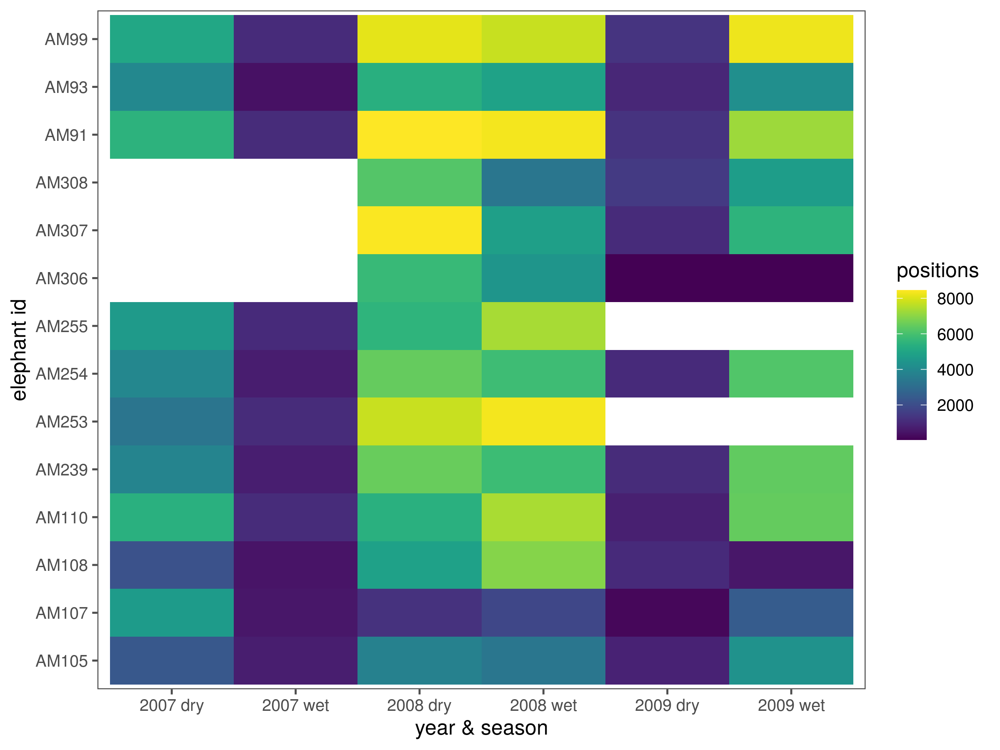
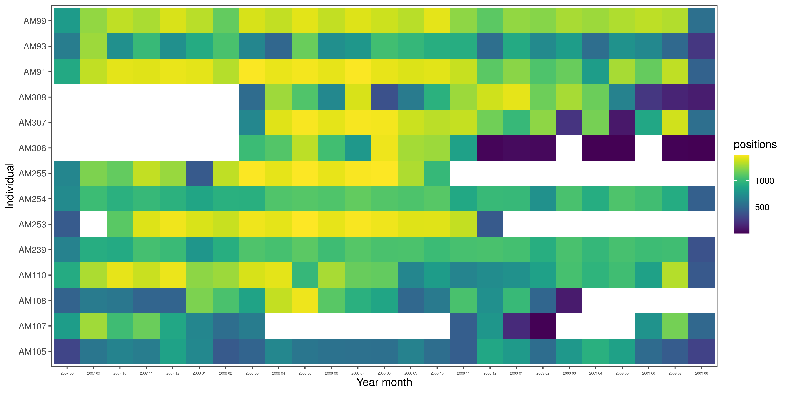
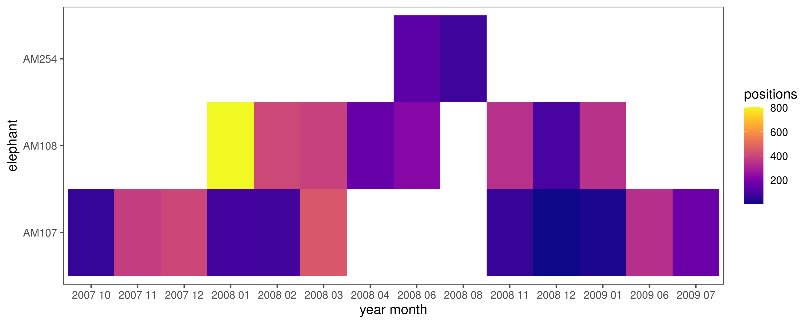

---
editor_options:
  chunk_output_type: console
---

# Supplementary material

This section explores the data in brief as supplementary material to the paper.

## Load libraries

```{r load_libs_s01, message=FALSE, warning=FALSE, eval=FALSE}

# load libraries
library(dplyr)
library(purrr)
library(lubridate)
library(readr)
library(glue)
library(stringr)

# spatial
library(sf)

# plotting
library(ggplot2)
library(ggthemes)
library(viridis)
```

## Load data

```{r load_data_s01, message=FALSE, warning=FALSE, eval=FALSE}
# load the preliminary data
ele.dry = read_csv("data/ele_data/ele.dry.csv")
ele.wet = read_csv("data/ele_data/ele.wet.csv")

# combine to form a single dataset with seasons assigned
ele.dry$season = "dry"
ele.wet$season = "wet"

#'rbind the data
ele = bind_rows(ele.dry, ele.wet)

# susbet columns and rename
ele = ele %>% 
  select(id = ID, ref = REF, long = LONGITUDE, lat = LATITUDE, 
         temp = TEMP, season, xutm = XUTM, yutm = YUTM, 
         time = Date_time, landscape = landsca, land.val = VALUE, 
         density = DENSITY, woody.density = `woody density`, 
         veg.class = VEG_CLASS, gertcode = Gertcode, v = STEPLENGTH, 
         angle = TURNANGLE, heading = BEARING, 
         distw = dist_water, distr = Dist_river)

#'change time to posixct via char
ele$time = as.POSIXct(as.character(ele$time), tz = "SAST", format = "%d-%m-%Y %H:%M")

# add hour and change column types 
ele = ele %>% 
  mutate(hour = hour(time), season = as.factor(season), 
         gertcode = as.factor(gertcode))
```

## Data distribution in time

### Seasonal summary

```{r data_spread_season_s01, message=FALSE, warning=FALSE, eval=FALSE}
# how many positions per elephant per year and season
data_season_summary = ele %>% 
  group_by(year_season = paste(year(time), season, sep = " ")) %>% 
  count(id)

# make figure
fig_season_summary = ggplot(data_season_summary)+
  geom_tile(aes(x = id, y = year_season, fill = n))+
  scale_fill_viridis()+
  theme_few()+
  labs(x = "elephant id",y = "year & season", fill = "positions")+
  coord_flip()

# save figure
ggsave(fig_season_summary, filename = "figs/fig_season_summary.png",
       width = 8, height = 6)
```

```{r fig_season_summary, eval=TRUE, echo=FALSE}
# import and show

```

### Monthly summary

```{r data_spread_months_s01, message=FALSE, warning=FALSE, eval=FALSE}
# positions per elephant per month and year
data_month_summary = group_by(ele, 
  year_month = glue('{year(time)} {str_pad(month(time), width = 2, pad = "0")}')) %>% 
  count(id)

# make figure
fig_month_summary = ggplot(data_month_summary)+
  geom_tile(aes(x = id, y = year_month, fill = n))+
  scale_fill_viridis()+
  theme_few()+
  theme(axis.text.x = element_text(size = 4))+
  labs(fill = "positions", x = "Individual", y = "Year month")+
  coord_flip()

# save figure
ggsave(fig_month_summary, filename = "figs/fig_month_summary.png",
       width = 12, height = 6)
```

```{r fig_month_summary, eval=TRUE, echo=FALSE}
# import and show

```

## Elephants near the weather station

Which elephants are within 10 km of the weather station at Skukuza, and when?

### Load Skukuza 

The weather station at Skukuza (24.9 S, 31.5 E) is our source for ambient temperature data.

```{r load_skukuza_sf, eval=FALSE, warning=FALSE, message=FALSE}

# load skukuza and make sf
skukuza = read_csv("data/skukuza.csv")
skukuza = st_as_sf(skukuza, coords = c("long", "lat")) %>% 
  `st_crs<-`(4326) %>% 
  st_transform(32736)

# get buffer around skukuza
skz_buf = st_buffer(skukuza, dist = 10000)
```

### Select elephants within 10 km

```{r make_ele_sf, eval=FALSE}
# make eles sf and crop by buffer
ele_sf = st_as_sf(ele, coords = c("long", "lat")) %>% 
  `st_crs<-`(4326) %>% 
  st_transform(32736)

ele_keep = st_contains(skz_buf, ele_sf)
ele_keep = unlist(ele_keep)

# eles to keep
ele_tower = ele[ele_keep,]
```

### Get distribution over time

```{r tower_ele_time_distr, eval=FALSE}

#'which eles are here and over which months?
data_tower_summary = group_by(ele_tower, 
  year_month = glue('{year(time)} {str_pad(month(time), width = 2, pad = "0")}')) %>% 
  count(id)

# make figure
fig_tower_summary = 
  ggplot(data_tower_summary)+
  geom_tile(aes(x = id, y = year_month, fill = n))+
  scale_fill_viridis(option="C")+
  theme_few()+
  labs(fill = "positions", x = "elephant", y = "year month")+
  coord_flip()

# save figure
ggsave(fig_tower_summary, filename = "figs/fig_tower_summary.png",
       width = 10, height = 4)
```

```{r fig_tower_summary, eval=TRUE, echo=FALSE}
# import and show

```
